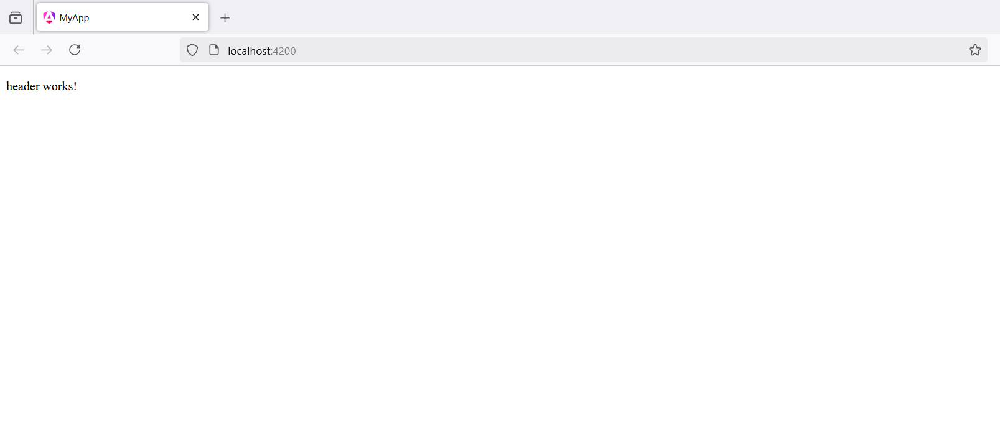
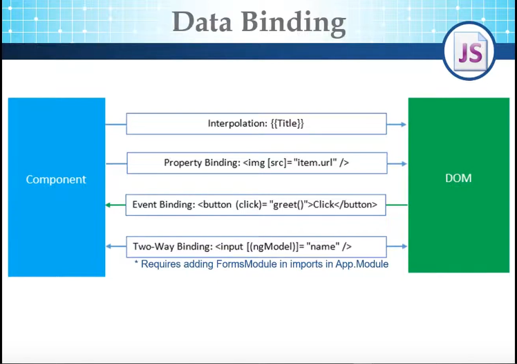

# angular-practice
## - Components

### - This version is Angular 19
### - Run this command to setup angular on your machine:

```bash
npm i -g @angular/cli
```
### - Then run this command to create a new angular project: 
```bash
ng new my-app
```
### - Then run this command to publish the project:
```bash
cd my-app
ng serve
```
### or
```bash
ng serve --open
```

### - Run this command to create a header component:
```bash
ng g c header
```

### - In src/index.html, this code is written.
#### File: `src/index.html`
```html
<!doctype html>
<html lang="en">
<head>
  <meta charset="utf-8">
  <title>MyApp</title>
  <base href="/">
  <meta name="viewport" content="width=device-width, initial-scale=1">
  <link rel="icon" type="image/x-icon" href="favicon.ico">
</head>
<body>
  <app-root></app-root>
</body>
</html>
```

- app-root is the app component.

### - This is the code of the app component.
#### File: `app.component.ts`
```typescript
import { Component } from '@angular/core';
import { RouterOutlet } from '@angular/router';

@Component({
  selector: 'app-root',
  imports: [RouterOutlet],
  templateUrl: './app.component.html',
  styleUrl: './app.component.css'
})
export class AppComponent {
  title = 'my-app';
}

```

- tag name is written in the selector attribute - ``` selector: 'app-root', ```
and this is the used word in the html.

### - To put header component in the app component, you have at first to pass the class of header component in the imports of the app components and use it as you want in the app component and then you have to import the component in the app component class file.
#### File: `app.component.ts`
```typescript
import { Component } from '@angular/core';
import { RouterOutlet } from '@angular/router';
import { HeaderComponent } from './header/header.component';

@Component({
  selector: 'app-root',
  imports: [RouterOutlet, HeaderComponent],
  templateUrl: './app.component.html',
  styleUrl: './app.component.css'
})
export class AppComponent {
  title = 'my-app';
}
```
### - Write the word header works! in the html of the header component.
#### File: `header.component.html`
```html
<p>header works!</p>

```
### - Write the header component in the html of the app component.
#### - File: `app.component.html`
```html
<app-header></app-header>
```



### - And Then the header component appear in the app component as in the image.

## - Data Binding



## - Directives
### - Components are directives with a template.
### - Structure directives are changing the layout of the elements.
### - Attribute directives are changing the appearance and behaviour of the elements.
### - ngIf
- To make an If condition on a div in html, you have to write this syntax.
- If the condition is true the div will be displayed, otherwise the div won't be displayed.
```html
<div *ngIf="status == true">Display</div>
```

### - ngFor
- To view students in a web page, you have to write this syntax in the ts file.
- and don't forget to import FormsModule and CommonModule
```typescript
import { CommonModule } from '@angular/common';
import { Component } from '@angular/core';
import { FormsModule } from '@angular/forms';

@Component({
  selector: 'app-header',
  imports: [FormsModule, CommonModule],
  templateUrl: './header.component.html',
  styleUrl: './header.component.css'
})
export class HeaderComponent {
  public name: string
  students: any[]
  constructor() {
    this.name = "moaz"
    this.students = [
      {id: 1, name: "abc"},
      {id: 2, name: "deg"},
      {id: 3, name: "hij"}
    ]
  }
}
```
- and write this syntax in the html.

```html
<ul>
    <li *ngFor="let student of students; let i = index">{{student.name}} - {{students.length}}</li>
</ul>
```
### - ng-template

- ng-template takes a label and doesn't appear if the label isn't executed and the div of the ng-template don't appear

```html

<div *ngIf="numGoods != 0; else outOfStock">{{numGoods}}</div>
<ng-template #outOfStock>Out Of Stock</ng-template>

```
### - ng-container
- the div of the ng-container don't appear and used with loops and switch

```html
<ng-container *ngFor="let student of students; let i = index">
  <div>{{student.name}}</div>
</ng-container>

```
## - Custom Directives

### - To make a custom directive, run this command on your terminal.

```bash
ng g directive LightBox
```

### - Use ElementRef to get the element which is in the html.
- Write this code.
```typescript
import { Directive, ElementRef, HostListener } from '@angular/core';

@Directive({
  selector: '[LightBox]'
})
export class LightboxDirective {

  constructor(private elementRef: ElementRef) {
    this.elementRef.nativeElement.style.display = "block";
    this.elementRef.nativeElement.style.border = "2px solid darkblue";
  }
  @HostListener('mouseover') onMouseOver() {
    this.elementRef.nativeElement.style.border = "3px solid yellow";
  }

  @HostListener('mouseout') onMouseOut() {
    this.elementRef.nativeElement.style.border = "2px solid darkblue";
  }
}

```
 - HostListener is used to make an event listener.
 - Call the directive in the html by this code.
```html
<div LightBox>Sentence</div>
```
- You can make an attribute with the directive like highlightColor in the following code.

#### File: `lightbox.directive.ts`
```typescript
import { Directive, ElementRef, HostListener, Input } from '@angular/core';

@Directive({
  selector: '[LightBox]'
})
export class LightboxDirective {
  @Input() highlightColor: string = "yellow"
  constructor(private elementRef: ElementRef) {
    this.elementRef.nativeElement.style.display = "block";
    this.elementRef.nativeElement.style.border = "2px solid darkblue";
  }
  @HostListener('mouseover') onMouseOver() {
    this.elementRef.nativeElement.style.border = `3px solid ${this.highlightColor}`;
  }

  @HostListener('mouseout') onMouseOut() {
    this.elementRef.nativeElement.style.border = "2px solid darkblue";
  }
}
```
- The html will be as follows.
```html
<div LightBox highlightColor="red">Sentence</div>
```
## - Setuping any package globally in angular.

- Run this command.

```bash
npm i bootstrap jquery
```

- Put files' paths in styles and scripts in build in bootstrap.json

#### File: `bootstrap.json`

```json
"styles": [
  "src/styles.css",
  "node_modules/bootstrap/dist/css/bootstrap.css"
],
"scripts": [
  "node_modules/bootstrap/dist/js/bootstrap.js",
  "node_modules/jquery/dist/jquery.js"
],

```

## - Routing

- To route the components, write this code in app.routes.ts.
- Make an object in routes array, this object contains the path of the page in the path attribute and the component in the component attribute.

#### File: `app.routes.ts`
```typescript
import { Routes } from '@angular/router';
import { HomeComponent } from './home/home.component';
import { AboutComponent } from './about/about.component';
import { ServiceComponent } from './service/service.component';

export const routes: Routes = [
    {path: "", component: HomeComponent},
    {path: "about", component: AboutComponent},
    {path: "service", component: ServiceComponent},
];

```

- In app component html, write this code.
#### File: `app.component.html`

```html
<router-outlet></router-outlet>
```

- you can use the hyperlink in routerLink attribute.
#### File: `header.component.html`
```html
<li><a routerLink="/" routerLinkActive="active" [routerLinkActiveOptions]="{ exact: true }">Home</a></li>
```
- and you have to import RouterModule in the component.

#### File: `header.component.ts`
```typescript
import { CommonModule } from '@angular/common';
import { Component } from '@angular/core';
import { FormsModule } from '@angular/forms';
import { RouterModule } from '@angular/router';

@Component({
  selector: 'app-header',
  imports: [FormsModule, CommonModule, RouterModule],
  templateUrl: './header.component.html',
  styleUrl: './header.component.css'
})
```
## - Pipes

### - To make a word uppercase, at first declare the variable in the typescript code.

```typescript
import { Component } from '@angular/core';
import { CommonModule } from '@angular/common';

@Component({
  selector: 'app-navbar',
  imports: [CommonModule],
  templateUrl: './navbar.component.html',
  styleUrl: './navbar.component.css'
})
export class NavbarComponent {
  word: string = "My words"
}
```
### - put the pipe uppercase on the variable to make the word uppercase.
```html
<p>{{word | uppercase}}</p>
```

## - Custom Pipes

### - Run this command in the terminal.

```bash
ng g p dollar
```
### - To write a dollar after the number, use this code.

```typescript
import { Pipe, PipeTransform } from '@angular/core';

@Pipe({
  name: 'dollar'
})
export class DollarPipe implements PipeTransform {

  transform(num: number | string): string {
    return num + "$";
  }

}

```
### - To use the pipe in a component, you have to import common module and the pipe and use the pipe in the html code.

```html
<p>{{word | dollar}}</p>
```
```typescript
import { Component } from '@angular/core';
import { CommonModule } from '@angular/common';
import { DollarPipe } from '../dollar.pipe';

@Component({
  selector: 'app-navbar',
  imports: [CommonModule, DollarPipe],
  templateUrl: './navbar.component.html',
  styleUrl: './navbar.component.css'
})
export class NavbarComponent {
  word: string = "My words"
}
```

### - If you used multiple parameters in the pipe function, the first parameter will be before the pipe symbol and the rest will be passed as the following:

```html
<p>{{word | con:12:"word2"}}</p>

```

## - Forms

### - To get data from a form, you have to import ReactiveFormsModule in typescript file and make form object of type FormGroup and write the parameters you want to put in your form.

```typescript
import { Component } from '@angular/core';
import { FormControl, FormGroup, ReactiveFormsModule } from '@angular/forms';

@Component({
  selector: 'app-add-form',
  imports: [ReactiveFormsModule],
  templateUrl: './add-form.component.html',
  styleUrl: './add-form.component.css'
})
export class AddFormComponent {
  form: FormGroup 
  constructor() {
    this.form = new FormGroup({
      name: new FormControl(),
      email: new FormControl(),
    });
  }

  send() {
    console.log(this.form.value.name);
    console.log(this.form.value.email);
  }
}

```
### - This is the html file.

```html
<form class="form" [formGroup]="form" (ngSubmit)="send();">
    <input type="text" name="name" formControlName="name">
    <input type="text" name="email" formControlName="email">
    <button>Submit</button>
</form>

```

### - You can use Validators.

```typescript
import { Component } from '@angular/core';
import { FormControl, FormGroup, ReactiveFormsModule, Validators } from '@angular/forms';

@Component({
  selector: 'app-forms',
  imports: [ReactiveFormsModule],
  templateUrl: './forms.component.html',
  styleUrl: './forms.component.css'
})
export class FormsComponent {
  form: FormGroup
  constructor() {
    this.form = new FormGroup({
      name: new FormControl('', Validators.required),
      email: new FormControl('', Validators.required)
    })
  }
  send() {
    console.log(this.form.get('name'));
    console.log(this.form.get('email'));
  }
}
```

```html
<form [formGroup]="form" (ngSubmit)="send();">
    <input type="text" formControlName="name">
    <input type="text" formControlName="email">
    <button [disabled]="form.invalid" >Submit</button>
</form>
```
## - Http Client

### - To use the Http Client to send and recieve data from the APIs, you have to use provideHttpClient() in app.config.ts and then make a service

#### File: `app.config.ts`

```typescript
import { ApplicationConfig, provideZoneChangeDetection } from '@angular/core';
import { provideRouter } from '@angular/router';

import { routes } from './app.routes';
import { provideClientHydration, withEventReplay } from '@angular/platform-browser';
import { provideHttpClient } from '@angular/common/http';

export const appConfig: ApplicationConfig = {
  providers: [
    provideZoneChangeDetection({ eventCoalescing: true }), 
    provideRouter(routes), 
    provideClientHydration(withEventReplay()), 
    provideHttpClient()
  ]
};
```

### - To make a service, write this command.

```bash
ng g s todolist
```

### - you can get data from API using get function in the API.
#### File: `todolist.service.ts`
```typescript
import { HttpClient } from '@angular/common/http';
import { Injectable } from '@angular/core';
import { Observable } from 'rxjs';

@Injectable({
  providedIn: 'root'
})
export class TodolistService {

  constructor(public _HttpClient: HttpClient) {
    

  }

  summary(): Observable<any> {
    return this._HttpClient.get('https://dummyjson.com/products');
  }
}

```
### - And inside the component, you can use it as the following:

#### File: `service-comp.component.ts`
```typescript
import { Component } from '@angular/core';
import { TodolistService } from '../todolist.service';

@Component({
  selector: 'app-service-comp',
  imports: [],
  templateUrl: './service-comp.component.html',
  styleUrl: './service-comp.component.css'
})
export class ServiceCompComponent {
  all_data: any

  constructor(public _Todolist: TodolistService) {
    
  }
  summary() {
    this._Todolist.summary().subscribe(data => {
      this.all_data = data;
      console.log(this.all_data);
    })
  }
}
```
#### File: `service-comp.component.html`
```html
<p>service-comp works!</p>
<button (click)="summary();">Get Products</button>
```
### - You can put the apiUrl in environment.
File: `src/environment/environment.ts`
```typescript
export const environment = {
    production: false,
    apiUrl: 'https://dummyjson.com'
};
```

### - So the class will be like the following.
```typescript
import { HttpClient } from '@angular/common/http';
import { Injectable } from '@angular/core';
import { Observable } from 'rxjs';
import { environment } from '../environment/environment'
@Injectable({
  providedIn: 'root'
})
export class TodolistService {

  constructor(public _HttpClient: HttpClient) {
    
  }

  summary(): Observable<any> {
    return this._HttpClient.get(environment.apiUrl + "/products");
  }

  one_product(id: number): Observable<any> {
    return this._HttpClient.get(environment.apiUrl + "/products/" + id);
  }
}
```

### - To view one product only in the page.

```typescript
import { HttpClient } from '@angular/common/http';
import { Component } from '@angular/core';
import { ActivatedRoute } from '@angular/router';
import { TodolistService } from '../todolist.service';

@Component({
  selector: 'app-one-product',
  imports: [],
  templateUrl: './one-product.component.html',
  styleUrl: './one-product.component.css'
})
export class OneProductComponent {
  id: any
  all_data: any
  constructor(public _TodolistService: TodolistService, public _ActivatedRoute: ActivatedRoute) {
    this.id = this._ActivatedRoute.snapshot.paramMap.get("id");
    this._TodolistService.one_product(this.id).subscribe(data => {
      this.all_data = data;
    });
  }
}
```

```html
<div>{{all_data.description}}</div>
```

## - Post request in HttpClient

## - Authentication in HttpClient

## - Update HTML and select using Angular

## - Updating Errors in Angular
